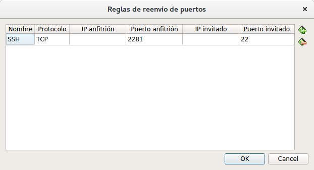

# Configurar SSH

En este anexo se explica cómo configurar una máquina virtual local Ubuntu para poder acceder a ella mediante ssh usando clave pública-privada.

En primer lugar crear una máquina virtual Ubuntu 16.04 con Oracle VirtualBox, instalar la imagen de [Ubuntu Server 16.04.1](https://www.ubuntu.com/download/server/thank-you?version=16.04.1&architecture=amd64).

Usar la configuración por defecto que utiliza VirtualBox, que incluye NAT como adaptador de red y en Avanzadas -> Reenvío de puertos, añadir la siguiente regla:



Instalar Ubuntu (como nombre de usuario usar, por ejemplo ubuntu. Será el utilizado posteriormente para conectarse vía ssh) y al iniciar atualizar e instalar ssh:

```
sudo apt-get update && sudo apt-get upgrade
sudo apt-get install ssh
```

Crear un par de claves. Como nombre, poner por ejemplo UbuntuVBox:

```
ssh-keygen -t rsa -b 2048 -v
```

Copiar el contenido del archivo `.pub` generado en el fichero `~/.ssh/authorized_keys` y copiar el otro en la máquina host desde donde se quiere conectar a la máquina virtual. Copiarlo en el directorio `~/.ssh` y añadirle la extensión `.pem`.

Finalmente, para realizar la conexión:

```
ssh -i ~/.ssh/UbuntuVBox.pem -p 2281 ubuntu@127.0.0.1
```

---

Volver a [home](index).
